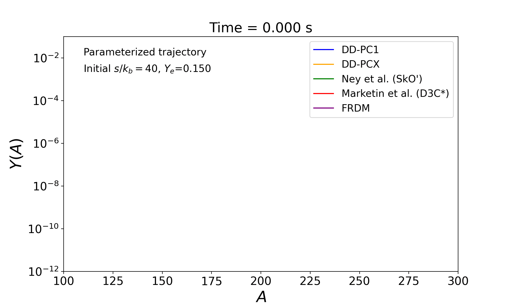

# beta_decay_RSN_2025
Repository for data and figures supporting **Large-scale calculations of β-decay rates and implications for r-process nucleosynthesis**  
*(Ravlić, Saito, and Nazarewicz — in preparation, 2025).*

# Overview

This repository aggregates:
1. **β-decay datasets** computed with axially deformed **RHB + pnQRPA** using the **DD-PC1** and **DD-PCX** interactions.
2. **r-process simulation outputs** used to assess astrophysical impact.

---

## Data formats

### Beta-decay tables (`data/beta_decay`)

Files:
- `data_DDPC1.txt`
- `data_DDPCX.txt`

Each file begins with a commented header (lines starting with `#`) that **defines the columns and units**. Basic description of columns:

| Column      | Meaning                                                                                 | Units / Notes                                  |
|-------------|------------------------------------------------------------------------------------------|-----------------------------------------------|
| `N`         | Neutron number                                                                           | integer                                        |
| `Z`         | Proton number                                                                            | integer                                        |
| `E(beta)`   | Binding energy for the **minimum-energy**                                                | MeV                                            |
| `beta2`     | Mass quadrupole deformation parameter $\beta_2$ at minimum-energy                        | dimensionless                                  |
| `Q`         | $\beta^-$ Q-value computed as `0.782 + B(Z,N) − B(Z+1,N−1)`                                     | MeV                                            |
| `HL_log10`  | `log10(T_half / s)` for the **total** half-life                                         | base-10 logarithm of seconds                   |
| `FF_percent`| Percent contribution of **first-forbidden (FF)** transitions to the **total decay rate** | %; computed from rates, clipped to            |

> Note: Strength function distribution is only given for a subset of 100 nuclei calculated with DD-PCX interaction. Strength functions for specific nuclei can be obtained by contacting the authors.  
---

### r-process outputs (`data/r-process`)

This directory contains simulation products (e.g., abundances, yields, trajectory diagnostics) used in the manuscript.  
Each subfolder may include its own minimal README describing run settings (network, trajectory set, thermodynamic history, etc.).

---
## Contact

**Ante Ravlić**  
Michigan State University / FRIB / University of Zagreb  
Email: [aravlic@phy.hr](mailto:aravlic@phy.hr)

**Yukiya Saito**  
Michigan State University / FRIB / University of Tennessee / University of Notre Dame
Email: [saitoy@frib.msu.edu](mailto:saitoy@frib.msu.edu)
